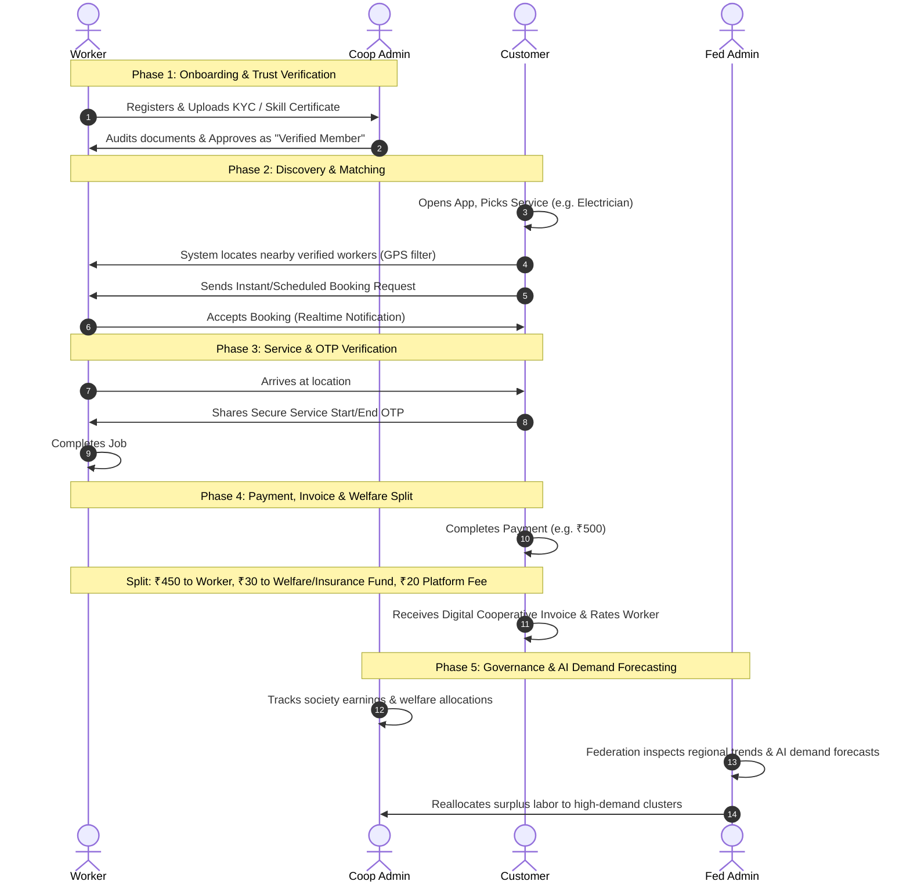
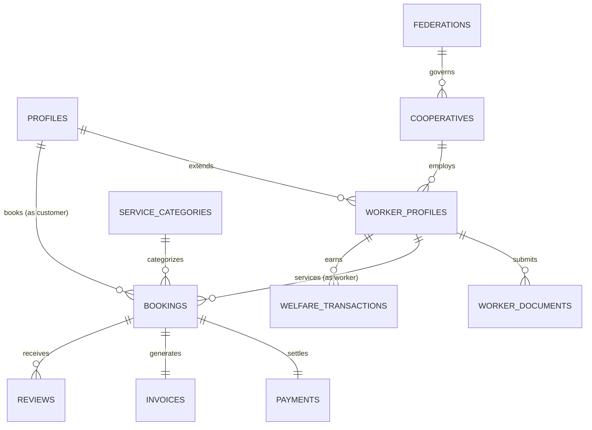

# Cooperative-Owned Digital Service Marketplace (PS-089)
## Product Specification & Architecture Blueprint

---

## 1. Product in One Sentence

> **A cooperative-owned digital gig marketplace that connects households with verified blue-collar workers, eliminating exploitative platform commissions while funding worker social security and community trust.**

---

## 2. Problem We Are Solving

### The Ground Reality
India has thousands of Labour Cooperative Societies and Federations representing millions of skilled tradespeople (electricians, plumbers, carpenters, painters, domestic helpers, caregivers, drivers, gardeners, cleaners, and technicians). Despite having certified skills and physical cooperative backing, these workers are losing their livelihood to venture-backed aggregator platforms.

### Why the Private Aggregator Model Fails Workers
* **Exploitative Commissions:** Private platforms charge 20% to 30% commission per completed job.
* **No Social Safety Net:** Workers are classified as disposable "gig partners" with zero health insurance, accident cover, or retirement security.
* **Algorithmic Tyranny:** Arbitrary account bans, forced discounts, and opaque penalty systems without human recourse.
* **Consumer Distrust:** Consumers pay premium prices, yet worker background verification is often opaque and superficial.

### Why the Cooperative Model Wins
* **Fair Wages & Low Commission:** The platform takes only a 3%–5% administrative fee strictly for platform upkeep and worker welfare.
* **Mandatory Welfare & Insurance Pool:** A micro-percentage of every completed service automatically funds the worker’s collective accident insurance and cooperative dividend pool.
* **Verified Local Trust:** Physical vetting through local Labour Cooperative Societies ensures verified criminal background checks and genuine trade skill validation.
* **Worker Ownership:** Surplus revenue is returned to workers as cooperative dividends.

### 45-Second Judge Pitch (For Presenters)
> *"Judges, private aggregators take up to 30% of a blue-collar worker’s wage while leaving them without health or accident insurance. Our app empowers Labour Cooperative Societies to launch their own digital marketplace. Customers get verified, geo-matched electricians and plumbers with OTP-verified safety and transparent pricing. Workers keep 95% of their wage, with 5% automatically accumulating into their cooperative welfare and insurance fund. Cooperative and Federation admins get live visibility and AI-driven demand forecasting to deploy workforce before shortages hit. It’s not just a service app—it’s social security through cooperative ownership."*

---

## 3. Who Uses the App

We are building a **single Flutter mobile application** supporting **four distinct roles**, determined upon login:

```
                          ┌──────────────────────────┐
                          │   Flutter Mobile App     │
                          │   (Single Codebase)      │
                          └─────────────┬────────────┘
                                        │
           ┌─────────────────┬──────────┴──────────┬─────────────────┐
           ▼                 ▼                     ▼                 ▼
     ┌───────────┐     ┌───────────┐         ┌───────────┐     ┌───────────┐
     │ Customer  │     │  Worker   │         │Cooperative│     │Federation │
     │(Household)│     │(Provider) │         │   Admin   │     │   Admin   │
     └───────────┘     └───────────┘         └───────────┘     └───────────┘
```

### 1. The Customer (Household / Institution)
* **Goal:** Needs a reliable, nearby plumber/electrician without price-gouging or safety risks.
* **Key Tasks:** Search services, view nearby verified cooperative workers, book instantly/schedule, track status, verify via OTP, pay digitally, download cooperative invoice, rate service.

### 2. The Worker / Service Provider (Cooperative Member)
* **Goal:** Regular local jobs, fair wages, fast payouts, and social benefits.
* **Key Tasks:** Register trade & society, upload Aadhaar & skill certificates, toggle online/offline availability, accept job requests, complete jobs with customer OTP, track daily earnings, inspect welfare balance.

### 3. The Cooperative Admin (Primary Society Manager)
* **Goal:** Manages local society operations (50–500 local workers), ensures compliance, and monitors local disputes.
* **Key Tasks:** Audit worker KYC & skill certificates, grant/revoke verified status, monitor active society bookings, oversee the Society Welfare Fund balance.

### 4. The Federation Admin (Apex / State Level Executive)
* **Goal:** Macro-level governance across multiple cooperative societies, welfare policy compliance, and regional workforce balance.
* **Key Tasks:** Cross-cooperative analytics, inter-district job distribution, AI demand forecasting, proactive worker reallocation from surplus to deficit zones.

---

## 4. Core Product Flow



---

## 5. Role & Permission Model

Security must be enforced at the **database level via Supabase Row-Level Security (RLS)** and **JWT claims**, not merely by hiding Flutter buttons.

### Permissions Matrix

| Resource / Action | Customer | Worker | Cooperative Admin | Federation Admin |
| :--- | :---: | :---: | :---: | :---: |
| **View Service Categories** | Read All | Read All | Read All | Read All |
| **Worker Profile Creation** | ❌ | Create Own | ❌ | ❌ |
| **View Worker Documents (KYC)** | ❌ | Read Own | Read (Own Society) | Read (All Societies) |
| **Approve/Verify Worker** | ❌ | ❌ | Update (Own Society) | Update (All Societies) |
| **Toggle Availability** | ❌ | Update Own | ❌ | ❌ |
| **Discover Nearby Workers** | Read (Verified Only) | ❌ | Read (All) | Read (All) |
| **Create Booking** | Create Own | ❌ | ❌ | ❌ |
| **Accept/Reject Job** | ❌ | Update (Assigned) | ❌ | ❌ |
| **Start/Complete Job (OTP)** | ❌ | Update (Assigned) | ❌ | ❌ |
| **View Invoices** | Read Own | Read Own | Read (Own Society) | Read (All Societies) |
| **Welfare Fund Ledger** | ❌ | Read Own Balance | Read Society Total | Read State Total |
| **AI Demand Forecasts** | ❌ | ❌ | Read (Local Area) | Read & Action All |

---

## 6. Core Modules

| # | Module | Primary User | Core Responsibility | Hackathon Status |
|---|---|---|---|---|
| 1 | **Authentication & Role Router** | All | Phone/Email auth via Supabase; instant role redirection. | **Must Have** |
| 2 | **Worker Onboarding & KYC** | Worker | Profile details, trade selection, document upload to Supabase Storage. | **Must Have** |
| 3 | **Worker Verification Desk** | Coop Admin | Review uploaded docs, toggle verification badge, maintain safety. | **Must Have** |
| 4 | **Customer Discovery & GPS Match** | Customer | Category browsing, radius-based worker discovery, profile inspection. | **Must Have** |
| 5 | **Booking & Job State Machine** | Customer / Worker | Complete lifecycle: `Requested` → `Accepted` → `In-Progress (OTP)` → `Completed`. | **Must Have** |
| 6 | **Digital Payment & Invoicing** | Customer | Transparent billing with cooperative breakdown (Wage + Welfare + Admin) and downloadable PDF/Receipt. | **Must Have** |
| 7 | **Rating & Trust Engine** | Customer | 5-star rating and written review tied to a verified booking ID. | **Must Have** |
| 8 | **Worker Welfare Ledger** | Worker / Coop Admin | Transparent accounting showing every ₹ contributed to worker insurance/welfare. | **Must Have** |
| 9 | **Emergency / SOS Booking** | Customer | Single-tap priority dispatch for urgent domestic failures (leakage, short circuit). | **Should Have** |
| 10 | **Cooperative Admin Dashboard** | Coop Admin | Society health metrics, active jobs, member verification queue. | **Must Have** |
| 11 | **Federation Governance & Analytics** | Fed Admin | Apex view: multi-society metrics, worker distribution, welfare metrics. | **Must Have** |
| 12 | **AI Demand Forecasting Engine** | Fed Admin | Predictive heatmap / chart showing upcoming service demand spikes & shortages. | **Should Have** |
| 13 | **Multilingual Localization (i18n)** | All | In-app language switcher for **English, Hindi (हिन्दी), and Marathi (मराठी)**. | **Must Have** |
| 14 | **Realtime Notifications** | All | Supabase Realtime alerts for booking dispatch, acceptance, and completion. | **Must Have** |

---

## 7. MVP vs Optional Features (2-Day Hackathon Scoping)

```
┌────────────────────────────────────────────────────────────────────────┐
│                        MUST HAVE (Hackathon Core)                      │
│ • Unified Auth with Role Routing (Customer, Worker, Coop, Federation)  │
│ • Worker KYC upload & Cooperative Admin 1-Click Verification           │
│ • Geo-location Customer Search (radius calculation, verified filter)   │
│ • Full Booking Lifecycle with OTP verification                         │
│ • Split Payment & Cooperative Invoicing (Wage vs Welfare vs Admin fee) │
│ • Worker Welfare Balance view (Cooperative differentiator!)            │
│ • Multilingual Support: English, Hindi, Marathi                        │
│ • Clean Demo Switcher (Instant switch between roles for judges)        │
└───────────────────────────────────┬────────────────────────────────────┘
                                    │
┌───────────────────────────────────▼────────────────────────────────────┐
│                        SHOULD HAVE (Differentiators)                   │
│ • AI Demand Forecast Widget (Pre-seeded seasonal time-series demo)     │
│ • Emergency 1-Tap Booking toggle                                       │
│ • Supabase Realtime status updates without manual pull-to-refresh       │
└───────────────────────────────────┬────────────────────────────────────┘
                                    │
┌───────────────────────────────────▼────────────────────────────────────┐
│                        NICE TO HAVE (Skip for MVP)                     │
│ • Live Uber-like driver map tracking (Not critical for scheduled home) │
│ • Real banking API / Razorpay production keys (Use simulated gateway)   │
│ • In-app Audio/Video calling (Use standard phone intents)              │
│ • Complex multi-tier insurance claim adjudication workflow             │
└────────────────────────────────────────────────────────────────────────┘
```

---

## 8. Judge Demo Story

To leave an unforgettable impression in 3–5 minutes, execute **one cohesive story** across four actors:

1. **The Problem Setup (30s):**
   * Introduce **Ramesh**, a certified electrician belonging to the *Shivaji Nagar Labour Cooperative Society*.
   * Show Ramesh's phone: He registers, selects "Electrician", and uploads his Aadhaar card & ITI certificate. His status is `Pending Verification`.

2. **The Cooperative Trust Layer (45s):**
   * Switch to **Sunita (Cooperative Admin)** on the same app.
   * Sunita sees Ramesh in the Verification Queue, reviews his documents, and clicks **Verify & Approve**.
   * Ramesh's status flips to `Verified Cooperative Member` with an official green badge.

3. **The Customer Need & Discovery (45s):**
   * Switch to **Aditi (Customer)** in Kothrud, Pune.
   * Aditi has an electrical short circuit. She opens the app, switches the language to **Marathi**, and taps "Electrician".
   * The app uses GPS to show nearby verified workers. Ramesh appears **1.2 km away, 4.8★, Verified Society Member**.
   * Aditi taps **Book Now**.

4. **The Job Execution & OTP Verification (45s):**
   * Ramesh receives a **real-time job notification** and taps **Accept**.
   * Aditi's screen updates in real time to "Worker on the way" with a 4-digit OTP (`7294`).
   * Ramesh arrives, enters the OTP to start, and later completes the job.

5. **The Cooperative Impact (Fair Wages + Welfare) (45s):**
   * Aditi pays ₹500 via UPI simulation.
   * An itemized **Cooperative Digital Invoice** appears:
     * *Ramesh's Take-Home Pay (90%):* ₹450
     * *Cooperative Welfare & Accident Insurance Fund (6%):* ₹30
     * *Society Platform & Maintenance (4%):* ₹20
   * Open Ramesh's wallet: His earnings increased by ₹450, and his **Social Security Insurance Pool** increased by ₹30.

6. **The Federation & AI Demand Engine (60s):**
   * Switch to **Federation Admin (Apex View)**.
   * Show state-wide analytics: Total active societies, jobs completed, and ₹ accumulated in the Worker Welfare Reserve.
   * Open **AI Demand Forecasting**: The AI model flags a **40% spike in electrical and plumbing demand next week due to pre-monsoon water logging in Pune Zone 3**.
   * The screen shows a recommendation: *"Reallocate 15 idle certified technicians from Zone 1 to Zone 3."*
   * **Judges are sold on the social mission, technical completion, and business viability.**

---

## 9. Flutter App Structure

### Architecture Pattern: Feature-First with Riverpod / Provider

```
lib/
├── main.dart
├── app/
│   ├── routes.dart                     # Role-based route guard
│   ├── theme.dart                      # Accessible, clean color tokens
│   └── l10n/                           # Multilingual ARB files (en, hi, mr)
├── core/
│   ├── network/supabase_client.dart    # Supabase singleton
│   ├── services/location_service.dart  # Geolocation & distance logic
│   └── widgets/role_switch_bar.dart    # Demo bar for judges to switch roles instantly
└── features/
    ├── auth/                           # Login, Registration, Role selection
    ├── customer/                       # Discovery, Booking, Checkout, Invoices
    ├── worker/                         # Job radar, OTP verification, Earnings/Welfare
    ├── cooperative/                    # Verification queue, Society roster, Welfare balance
    └── federation/                     # Cross-coop metrics, AI Demand Forecast graphs
```

### Screen Flow & Navigation Hierarchy

```
                                [ Splash / Auth Guard ]
                                           │
                    ┌──────────────────────┴──────────────────────┐
                    ▼                                             ▼
             [ Login Screen ]                           [ Active Session ]
           (Phone / Magic Link)                                   │
                                                                  ▼
                                                          [ Role Router ]
             ┌──────────────────────┬─────────────────────────────┼──────────────────────┐
             ▼                      ▼                             ▼                      ▼
     ┌───────────────┐      ┌───────────────┐             ┌───────────────┐      ┌───────────────┐
     │ Customer Home │      │  Worker Home  │             │   Coop Home   │      │Fed Admin Home │
     └───────┬───────┘      └───────┬───────┘             └───────┬───────┘      └───────┬───────┘
             │                      │                             │                      │
       Bottom Nav:            Bottom Nav:                   Bottom Nav:            Bottom Nav:
     • Explore / Map        • Job Radar (Requests)        • KYC Approvals        • State Metrics
     • Active Bookings      • Active Job (OTP entry)      • Active Jobs          • Society Roster
     • Welfare Impact       • Earnings & Welfare          • Society Fund         • AI Demand Map
     • Profile & Lang       • Profile / Documents         • Profile / Settings   • Policy Audit
```

---

## 10. Supabase Data Model (High-Level Schema)

### Entity Relationship Model



### Core Entities & Role Ownership

1. **`profiles`**
   * Holds user authentication link (`id` references `auth.users`), `full_name`, `phone`, `role` (`customer`, `worker`, `cooperative_admin`, `federation_admin`), and `preferred_language`.
   * *Security:* Users read/update their own profile.

2. **`federations` & `cooperatives`**
   * `federations`: Apex bodies (e.g., *Maharashtra Labour Cooperative Federation*).
   * `cooperatives`: Primary societies linked to a `federation_id`, with registration numbers, district, and bank escrow details.

3. **`worker_profiles`**
   * Extends `profiles` for worker accounts.
   * Contains `cooperative_id`, `trade_category` (e.g., Electrician), `experience_years`, `verification_status` (`pending`, `verified`, `rejected`), `is_online`, `current_lat`, `current_lng`, `rating_avg`, and `welfare_fund_balance`.
   * *Security:* Workers update their own availability/coordinates. Only Coop/Fed admins update `verification_status`.

4. **`worker_documents`**
   * Stores URLs to Aadhaar and trade certificates in Supabase Storage (`worker_docs` bucket).
   * *Security:* Only the worker and their Society/Federation Admin can read these files.

5. **`service_categories`**
   * Standard services (e.g., Plumbing, Electrical, Carpentry, Painting) with standard baseline fair-wage hourly/fixed rates agreed by the cooperative council.

6. **`bookings`**
   * Captures the entire service transaction:
     * `customer_id`, `worker_id`, `category_id`, `cooperative_id`
     * `status` (`requested`, `accepted`, `in_progress`, `completed`, `cancelled`)
     * `booking_lat`, `booking_lng`, `address_text`
     * `scheduled_time`, `start_otp` (4-digit random string), `completed_at`
     * `total_amount`, `worker_wage`, `welfare_contribution`, `platform_fee`
   * *Security:* Restricted to the associated customer, assigned worker, and society admin.

7. **`payments` & `invoices`**
   * `payments`: Stores transaction references, simulated payment gateway response, method (UPI/Cash), status.
   * `invoices`: Immutable receipt record tracking the split of funds (Wage vs Welfare vs Platform).

8. **`welfare_transactions`**
   * An append-only ledger tracking every credit to the worker's social security pool: `worker_id`, `booking_id`, `amount`, `transaction_type` (`job_contribution`, `interest`, `claim_payout`).

9. **`demand_forecasts`**
   * Pre-computed AI demand data: `cooperative_id`, `service_category_id`, `district`, `forecast_period`, `predicted_demand_score` (1–100), `worker_shortage_count`, `action_recommendation`.

---

## 11. Geo-Location Strategy (Practical MVP)

Judges want to see genuine proximity matching without requiring expensive Google Maps API bills during a 48-hour hackathon.

### The Practical Hackathon Implementation

```
[ Customer Location ] (GPS / Geolocation Plugin)
         │
         ▼
[ Supabase RPC Function / Query ]
  • Filter 1: role = 'worker'
  • Filter 2: verification_status = 'verified'
  • Filter 3: is_online = true
  • Filter 4: trade_category = selected_category
         │
         ▼
[ Distance Calculation ]
  • Haversine formula executed via PostgreSQL function:
    distance_km = 6371 * acos( cos(radians(cust_lat)) * ... )
  • Order by distance_km ASC
         │
         ▼
[ Flutter UI Display ]
  • List Cards / Simple OpenStreetMap tiles: "Ramesh • 1.2 km away • 15 mins arrival"
```

* **Client-side:** Use Flutter `geolocator` to fetch user coordinates (`latitude`, `longitude`).
* **Map Display:** Use `flutter_map` with free OpenStreetMap tiles instead of Google Maps to avoid API key and billing complications during the presentation.
* **Worker Availability:** Workers have a clean switch on their home screen: `Go Online / Go Offline`. When toggled online, it records their current GPS location.

---

## 12. AI Strategy: Realistic Demand Forecasting

Judges immediately reject unrealistic claims of training complex neural networks live during a hackathon. What wins awards is a **well-grounded, functional predictive prototype** that addresses the specific mandate of PS-089.

### The Approach: Seasonal Historical Time-Series + Deficit Analyzer

```
  ┌─────────────────────────────────────────────────────────────┐
  │ Seed Historical Data (12 Months of Bookings across 5 Zones) │
  └──────────────────────────────┬──────────────────────────────┘
                                 │
                                 ▼
  ┌─────────────────────────────────────────────────────────────┐
  │             Edge Function / Python Forecast Engine          │
  │  • Multiplies baseline volume by Seasonal Trend Multiplier  │
  │    (e.g., Monsoon = 1.6x Plumbing, Diwali = 2.0x Painting)  │
  │  • Computes: Projected Demand vs Registered Active Workers  │
  └──────────────────────────────┬──────────────────────────────┘
                                 │
                                 ▼
  ┌─────────────────────────────────────────────────────────────┐
  │                 Federation Admin Dashboard                  │
  │  • Red Alert: "Zone 3 Electricians Deficit: -12 Workers"    │
  │  • Recommendation: "Reallocate 12 workers from Zone 1"     │
  └─────────────────────────────────────────────────────────────┘
```

### What We Actually Demonstrate in the Demo
1. **The Federation AI Screen:** Displays an interactive demand curve across city zones for the upcoming 14 days.
2. **Deficit Detection:** The model compares forecasted bookings against active verified workers in that zone.
3. **Actionable Allocation:** If Zone B has 80 projected plumbing bookings but only 40 certified workers, the system generates an automated alert: *"High Risk of Unfulfilled Bookings in Zone B. Recommend temporary cross-society shift for 20 workers."*

---

## 13. Multilingual Strategy (i18n)

The Problem Statement explicitly requires a multilingual solution. Blue-collar workers and cooperative administrators must be able to use the app in regional languages.

### Target Languages
1. **English** (Default / Admin)
2. **Hindi (हिन्दी)**
3. **Marathi (मराठी)** (Primary regional cooperative language in Maharashtra / Central India)

### Practical Flutter Implementation
* Use Flutter's native `flutter_localizations` with `.arb` files:
  * `app_en.arb`
  * `app_hi.arb`
  * `app_mr.arb`
* **What to translate:** All static UI text, category names (e.g., *Electrician* → *इलेक्ट्रीशियन* / *वीजतंत्री*), booking statuses, buttons, and alert messages.
* **What NOT to translate:** Dynamic user comments, names, or addresses (avoids latency and costly translation APIs).
* **Language Switcher:** A persistent language icon in the app bar and a language picker at first launch.

---

## 14. What We Should NOT Build (Hackathon Anti-Patterns)

To deliver a working product in 48 hours, avoid these time traps:

1. ❌ **Live Turn-by-Turn GPS Tracking:** Do not build real-time Uber-like vehicle movement on a map. Household services are scheduled or on-demand with ETA notifications; static distance ("1.2 km away") is sufficient.
2. ❌ **Real Production Payment Gateways:** Avoid real merchant KYC onboarding. Build a realistic simulated UPI bottom sheet ("Pay with GPay / PhonePe") that triggers database updates and outputs an authentic cooperative invoice.
3. ❌ **Separate Web Portals for Admins:** Do not split time building a Flutter app AND a separate React web portal. Build all four roles inside the **same responsive Flutter app** using role-based navigation.
4. ❌ **Full Insurance Claim Adjudication System:** Show the welfare ledger accumulating money per job and an "Apply for Insurance" button. Do not build an entire insurance underwriter dashboard.
5. ❌ **Complex Microservices & Docker Swarms:** Supabase provides Auth, PostgreSQL, Storage, and Realtime out of the box. Do not set up external Node/Express servers unless an Edge Function is strictly required.

---

## 15. Final Recommended Architecture

```
┌────────────────────────────────────────────────────────────────────────┐
│                        FLUTTER CLIENT APPLICATION                      │
│                                                                        │
│   [Customer View]     [Worker View]     [Coop View]     [Fed View]     │
│   • Discovery / GPS   • Job Radar       • KYC Desk      • Analytics    │
│   • Booking & Pay     • OTP & Earnings  • Job Monitor   • AI Forecast  │
│   • Invoicing         • Welfare Ledger  • Fund Summary  • Allocation   │
│                                                                        │
│   State Management: Riverpod / Provider  •  Localization: en, hi, mr   │
└───────────────────────────────────┬────────────────────────────────────┘
                                    │
                                    │ HTTPS / WSS
                                    ▼
┌────────────────────────────────────────────────────────────────────────┐
│                        SUPABASE BACKEND PLATFORM                       │
│                                                                        │
│   ┌───────────────────┐  ┌───────────────────┐  ┌──────────────────┐   │
│   │   Supabase Auth   │  │ Supabase Realtime │  │ Supabase Storage │   │
│   │ (Phone/Password)  │  │ (Bookings & OTP)  │  │ (KYC Docs/Icons) │   │
│   └───────────────────┘  └───────────────────┘  └──────────────────┘   │
│                                                                        │
│   ┌────────────────────────────────────────────────────────────────┐   │
│   │                     PostgreSQL Database                        │   │
│   │  • Tables: profiles, workers, cooperatives, bookings, etc.     │   │
│   │  • Row Level Security (RLS) policies for strict RBAC           │   │
│   │  • Stored Functions: Haversine distance calculation            │   │
│   │  • Append-only Worker Welfare Ledger                           │   │
│   └────────────────────────────────────────────────────────────────┘   │
│                                   │                                    │
│   ┌───────────────────────────────┴────────────────────────────────┐   │
│   │                    Supabase Edge Functions                     │   │
│   │  • AI Demand Forecasting algorithm & workforce allocation seed │   │
│   │  • Split-payment ledger calculation logic                      │   │
│   └────────────────────────────────────────────────────────────────┘   │
└────────────────────────────────────────────────────────────────────────┘
```

---

## 16. Suggested Development Order (48-Hour Execution Plan)

```mermaid
gantt
    title 48-Hour Hackathon Execution Roadmap
    dateFormat  X
    axisFormat Hour %X

    section Backend & Auth
    Supabase Schema, RLS, & Seed Data       :0, 6
    Auth & Role Router Integration         :4, 8

    section Core Workflows
    Worker KYC Onboarding & Uploads         :8, 14
    Coop Admin Verification Desk            :12, 18
    Customer Discovery & Haversine Match    :16, 24
    Booking State Machine & OTP Flow        :22, 30

    section Value Differentiators
    Split Payment, Invoice & Welfare Ledger :28, 36
    Multilingual Strings (en, hi, mr)       :34, 40
    Federation Dashboard & AI Forecast      :38, 44

    section Demo Polish
    Judge Quick-Switch Bar & Rehearsal      :42, 48
```



### Detailed Breakdown

* **Phase 1: Foundation & Data Layer (Hours 0 – 8)**
  * Create the Supabase project.
  * Define PostgreSQL schema: `profiles`, `worker_profiles`, `cooperatives`, `service_categories`, `bookings`, `invoices`, `welfare_transactions`.
  * Set up Supabase Storage bucket for worker KYC documents.
  * Implement base Flutter shell with Splash, Login, and Role-Based Home Switcher.

* **Phase 2: Worker Onboarding & Cooperative Verification (Hours 8 – 18)**
  * Build Worker profile setup: trade selection, document upload.
  * Build Cooperative Admin screen: view pending workers, inspect documents, click **Approve/Reject**.
  * Confirm that unverified workers are excluded from customer search results.

* **Phase 3: Customer Search, Proximity Matching & Booking (Hours 18 – 30)**
  * Implement service category selector.
  * Implement geo-matching query with distance sorting.
  * Build Booking dialog (Instant vs Scheduled).
  * Build Worker Job Radar: receive incoming booking via Supabase Realtime, tap **Accept**.
  * Build OTP generation on customer app and OTP verification on worker app to complete the service.

* **Phase 4: Welfare Ledger, Invoicing & Multilingual (Hours 30 – 40)**
  * Build the payment simulation bottom sheet.
  * Create the Cooperative Digital Invoice showing the split: Worker Wage (90%), Welfare/Insurance Fund (6%), Platform Maintenance (4%).
  * Update Worker Welfare Ledger screen showing accumulated insurance balance.
  * Wire up `flutter_localizations` with English, Hindi, and Marathi translations.

* **Phase 5: Federation Analytics, AI Engine & Demo Polish (Hours 40 – 48)**
  * Build Federation Dashboard: multi-cooperative summary cards.
  * Build AI Demand Forecast screen: chart displaying predicted seasonal demand vs available workers with reallocation recommendations.
  * Add a hidden/accessible **"Judge Role Switcher"** floating bar so presenters can instantly jump between Customer, Worker, Cooperative, and Federation roles during live evaluation.
  * Rehearse the 3-minute demo script.
